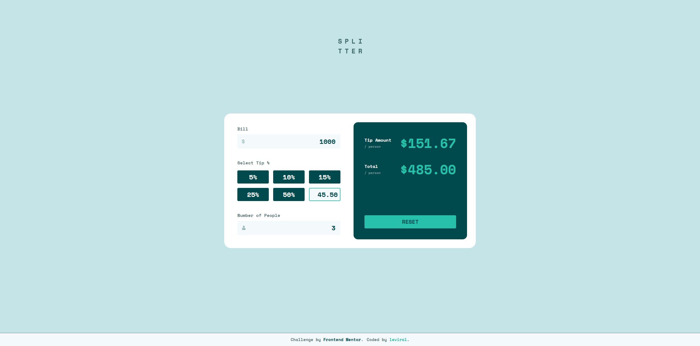
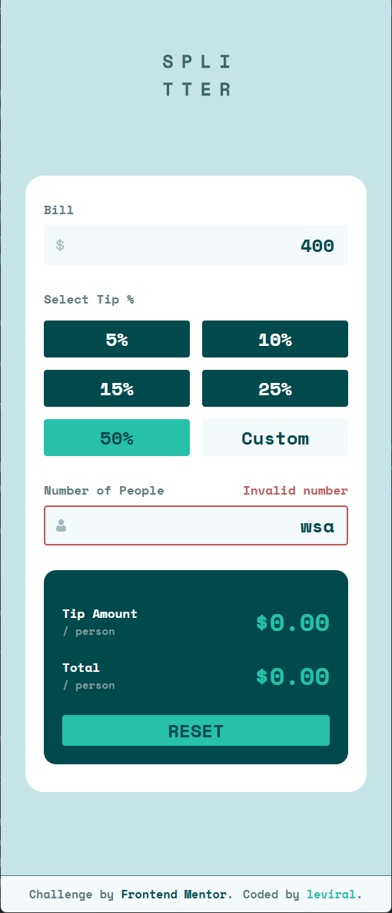

# Frontend Mentor - Tip calculator app solution

This is a solution to the [Tip calculator app challenge on Frontend Mentor](https://www.frontendmentor.io/challenges/tip-calculator-app-ugJNGbJUX). Frontend Mentor challenges help you improve your coding skills by building realistic projects.

## Table of contents

- [Overview](#overview)
  - [The challenge](#the-challenge)
  - [Features](#features)
  - [Screenshot](#screenshot)
  - [Links](#links)
- [My process](#my-process)
  - [Built with](#built-with)
  - [What I learned](#what-i-learned)
  - [Useful resources](#useful-resources)
- [Author](#author)

## Overview

### The challenge

Users should be able to:

- View the optimal layout for the app depending on their device's screen size
- See hover states for all interactive elements on the page
- Calculate the correct tip and total cost of the bill per person

### Features

- Full responsiveness (desktop & mobile friendly)
- Interactive tip selection (preset buttons + custom input)
- Real-time calculation logic with JavaScript
- Constraint Validation API used to prevent invalid inputs and ensure data integrity
- Reset functionality to clear inputs and results

This challenge was inspired by Frontend Mentor, coded by me from scratch.

### Screenshot

### Links

- Solution URL: [Frontend Mentor]()*
- Live Site URL: [Netlify]()*

## My process

### Built with

- Semantic HTML5 markup
- CSS custom properties
- Flexbox
- CSS Grid
- Mobile-first workflow
- JS
- Constraint Validation API

### What I learned

- how to use the Constraint Validation API along with smart regex patterns to catch possible input errors and prevent calculation mistakes

### Useful resources

- [YouTube](https://youtu.be/h5qqmE83Tes?si=qInPvhmKzfRCFbl9) - Helpful tips on working with the Constraint Validation API

## Author

- GitHub - [leviral](https://github.com/leviral)
- Frontend Mentor - [@leviral](https://www.frontendmentor.io/profile/leviral)
